# CVFX Homework5 Team11

This is NTHU CVFX course project 5 of `team 11`. Here we use saliency mask to help crating many types of *multi-view 3D visual effects* including:
- motion parallax
- stop motion
- live photo
Also with the help of saliency mask, we can post-processing the image for to fix the color of certain pixels and thus enhance the final effect (detail describe in below).


## Saliency mask
Saliency is defined by the most noticeable part in the image for a human. The use of saliency mask in this multi-view visual effects project is obivious. We use the mask the help deciding which features to track or filter, instead of defining rule (e.g. the translation of the features) to classify the detected features into foreground and background.

We use a state-of-the-art saliency prediction model, PiCANet ([paper](https://arxiv.org/abs/1708.06433), [github](https://github.com/Ugness/PiCANet-Implementation), Liu et al., CVPR'18), to yield saliency mask of each image for later 3D visual effects.


## Multi-view 3D visual effects

In below, we will present the results of each effect and briefly describe them, showing the results of different setting.

### Motion Parallax
In this effect, we want to align the two images such that the main role, the saliency, move as little as possible. To to this, we use the saliency mask the filter all non foreground sift features and align the two images based on the features inside the saliency mask.

The first example is a `city caffe`, if we simply stack the two image without doing anything we will get:

| Img1 | Img2 | Do nothing |
| :--: | :--: | :--: |
| 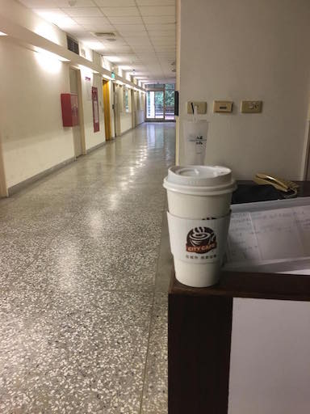 | 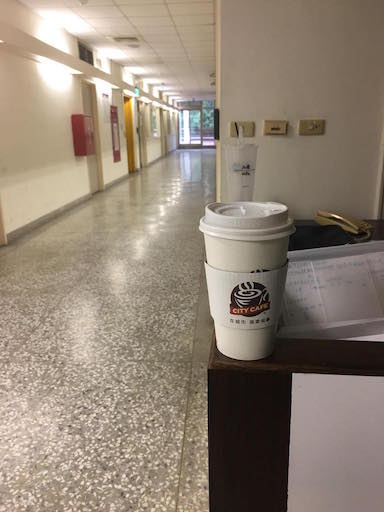 |  |

We use saliency mask to keep sift features of the `city caffe`. Note that the saliency masks are actually a grey images, we blend them with the original color image for better visualization:

| Saliency of Img1 | Saliency of Img2 | Keeped SIFT features |
| :--------------: | :--------------: | :------------------: |
|  | 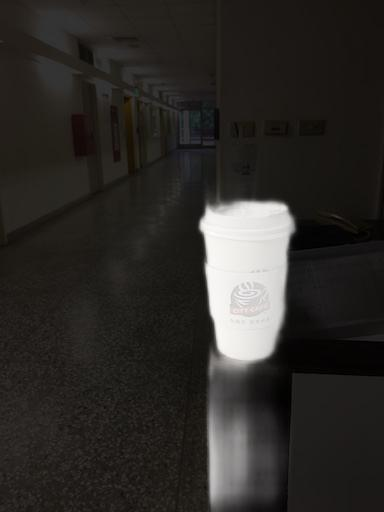 | 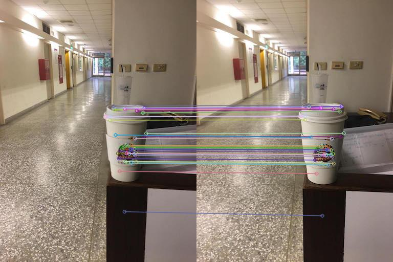 |

Finally, we align Img1 to Img2 by homography and also showing the result of fixing pixels in saliency region:

| Do nothing | Align | Fix saliency pixels |
| :--------: | :---: | :-----------------: |
|  | 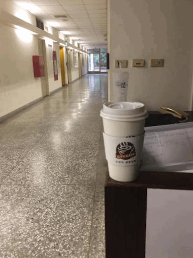 |  |


Yet another example of motion parallax:

| Img1 | Img2 | Do nothing |
| :--: | :--: | :--: |
|  | 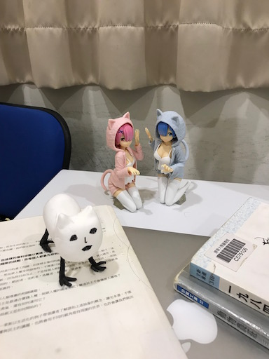 |  |

| Saliency of Img1 | Saliency of Img2 | Keeped SIFT features |
| :--------------: | :--------------: | :------------------: |
|  | 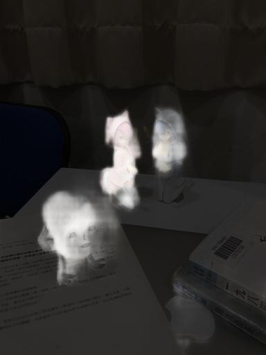 | 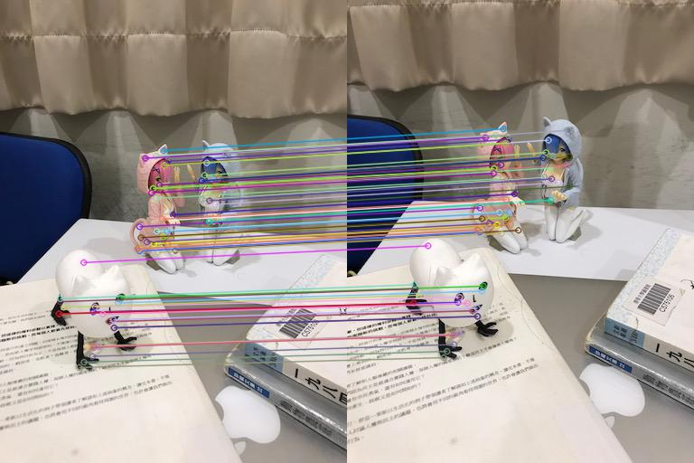 |

We show the result by different alignment algorithm. The translation model have 2 degree of freedom and can only left/right/top/down shift the image. The affine model have dof=5 and can translate, scale and inplane rotate the image. The homography model is the strongest and can align features on different 3D planes. Please *Stop Motion* effect for better understanding the different of the three alignment models.

| Align by translation (DoF=2) | Align by affine (DoF=5) | Align by homography (DoF=8) |
| :--------: | :---: | :-----------------: |
|  |  | 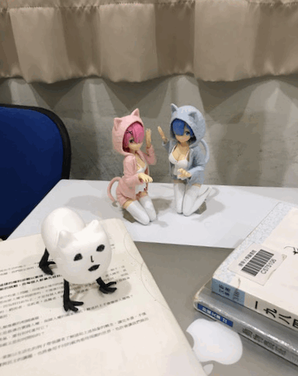 |


### Stop Motion
The implementation of stop motion effect is very similar to motion parallax. The only different is that we apply the same process like motion parallax in each adjacency frames and align all the image to the middle frame.

We first showing a case `mos burger` to depicting the different of each alignment models:

| Do nothing | Align by translation (DoF=2) | Align by affine (DoF=5) | Align by homography (DoF=8) |
| :--------: | :-----------: | :-----------: | :-----------: |
|  | 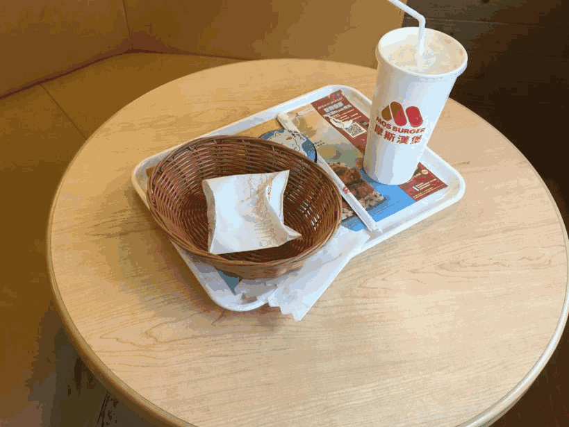 (impossible to model) | 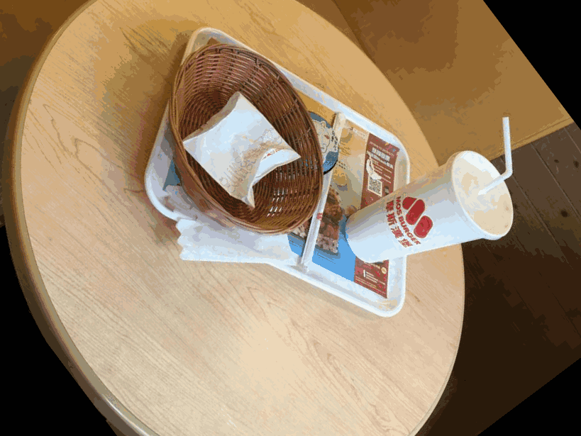 (table center fix) | 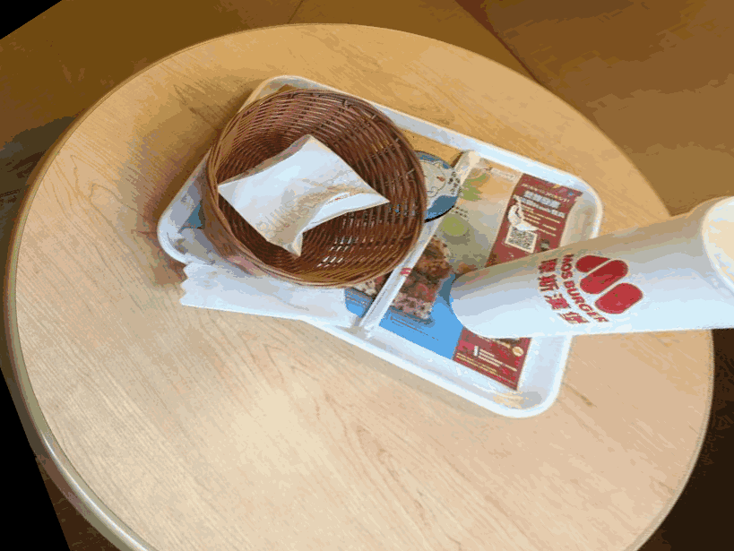 (table plane fix) |

Result explanation:
- **Align by translation:** in this failre example, the foreground features are rotate in the image plane and thus make it impossible to model by only shift the image.
- **Align by affine:** the affine alignment can model image shift, scale and inplane rotation. As a result, fix the center of the table and make it look like rotate alone the table center.
- **Align by homography:** the homography can model plane to plane transform in 3D space which make the table plane fix in the result.

<br>
Next we want to show a succesful example which the image plane is align with the gravity direction and thus the foreground features can easily be modeled by affine transform.

| Do nothing | Align by affine (DoF=5) |
| :--------: | :-----------: |
| 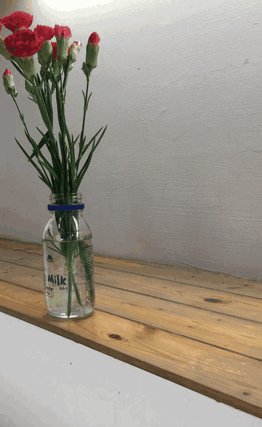 | 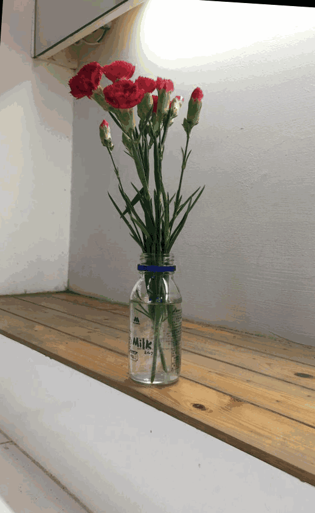 |


### Live Photo
- For previous 2 tasks, we use saliency mask to filter out all non-salient sift features, while for live photo, we align the images based on the background features (outside the saliency mask).
- Column 1 shows the saliency maps for all frames.
- Column 2 shows the raw video frames without alignment.
- For column 3,4,5, we use saliency maps to match only background features, and align all frames with homography model.
- For Column 4 & 5, we create a fixed background (BG) image by taking median along all frames, then fill the BG pixels (based on the ```BG mask```) in each frame with the corresponding pixels of the median BG image.

#### Create ```BG mask``` for fixing background  
- For column 4, the ```BG mask```  is defined as the sum of the standard deviations of R/G/B channels along all frames.
	- to remove the noise in RGB variance map cuased by illumination change and the small movements of objects (since the alignment is not perfect enough), we apply 2D gaussian filter on the raw RGB variance map, then we obtain the binary BG mask by thresholding.
	-   
- For column 5, the ```BG mask``` is defined as the union of salency maps of all frames.
	

#### Example: mediatek
|          | saliency |     raw        |   only align   |  fix BG w/ RGB variance | fix BG w/ union of saliency |
| :------: | :------: | :------------: | :--------------: | :------------------: | :------: |
|  Result  |  |  |  |  |  |
|  BG mask | | | |   |  |

#### Example: standing human
|          | saliency |     raw        |   only align   |  fix BG w/ RGB variance | fix BG w/ union of saliency |
| :------: | :------: | :------------: | :--------------: | :------------------: | :------: |
|  Result  | 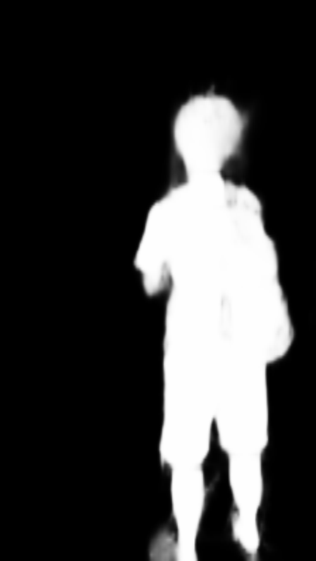 |  |  |  |  |
|  BG mask | | | |  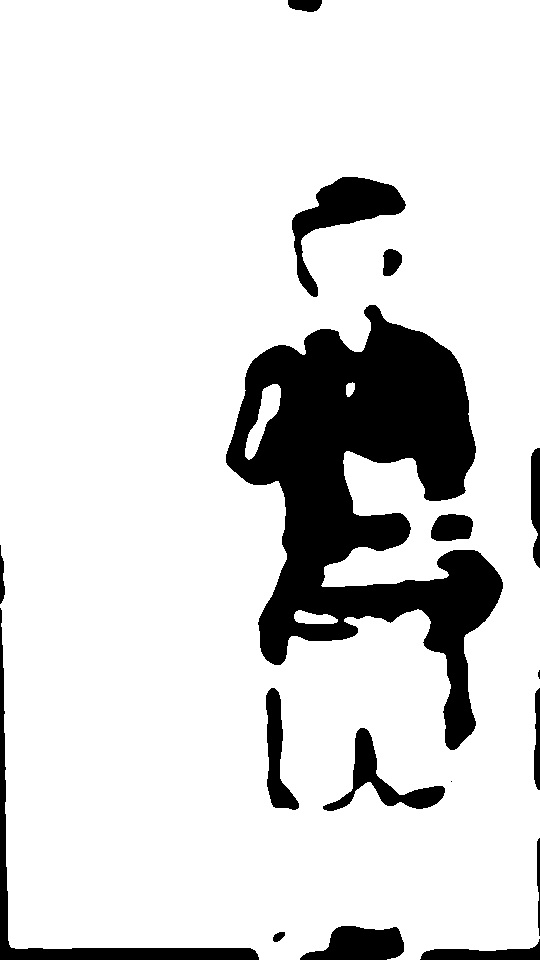 |  |

#### Failure Example: tissue
- In this example, many objects on different planes of different depths are predicted as saliency, so the alignment is a little bit worse than the previous example.
- The ```fix BG w/ union of saliency``` fails as the saliency model only recognize part of tissue.
- In summary, saliency model is useful for filtering features used to align frames when only one salient object exists. But saliency model are prone to failure when there are multiple objects, and thus SIFT features of various depths would be kept for estimating the homography (as shown in the ```Motion Parallax``` section). In this case, robust estimation algorithms (e.g. RANSAC) is important for fixing the problem. 

|          | saliency |    raw         |   only align   |  fix BG w/ RGB variance | fix BG w/ union of saliency |
| :------: | :------: | :------------: | :--------------: | :------------------: | :------: |
|  Result  | 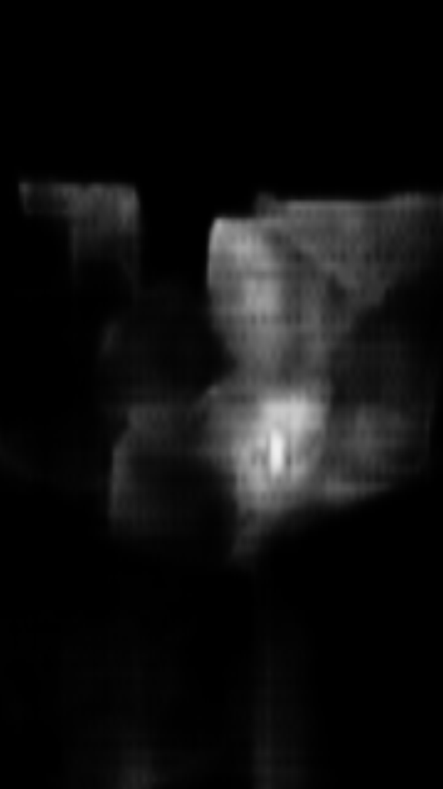 |  | 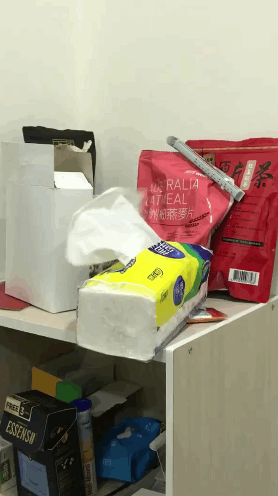 | 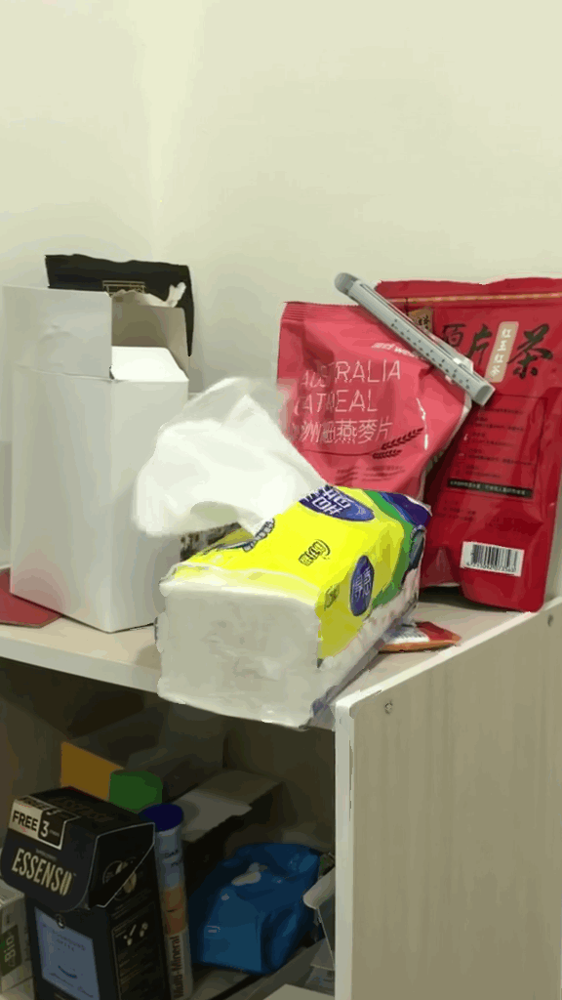 |  |
|  BG mask | | | |  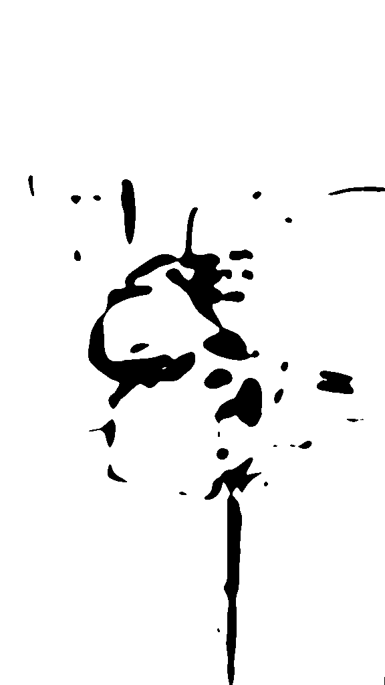 |  |

